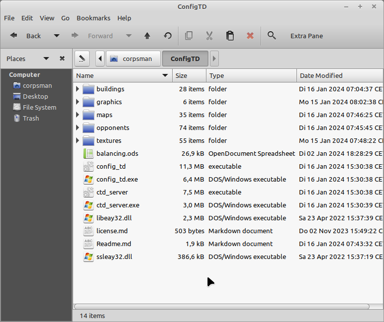

# Config Tower Defense (Config TD) Data Repository

This is the data repository for [Config TD](https://github.com/PascalCorpsman/ConfigTD).

This repository holds all additional data like maps, buildings, opponents, textures and what ever else someone can think of, that fills the game with life.

The idea behind is, to seperate code from user data, this way you can more easily contribute to the project.

## What needs to be done to play the game

1. Create a directory on your computer e.g. "ConfigTD"
2. Download the content of the [bin](https://github.com/PascalCorpsman/ConfigTD/tree/main/bin) folder according to your operating system and store it in "ConfigTD"
3. Merge the content of this repository
4. Merge the content of the [Config TD Data](https://github.com/PascalCorpsman/ConfigTD_Data) repository (holds maps and all the other gaming content) into "ConfigTD"
5. Your directory should now look like this 
6. Read the [manual](https://github.com/PascalCorpsman/ConfigTD/tree/main/documentation/Readme.md) as needed
   

Linux users may need to run the following commands at least once: 

SSH bindings:

> sudo apt-get install libssl-dev

OpenGL bindings:

> sudo apt-get install freeglut3-dev

## I want to contribute what is needed ?

The project needs
- more maps
- more graphics
- more tutorials

### Rules to contribute:

- The Project language is english
- All content you contribute need to be free and compatible to the projects [license](license.md)

## External sources

This repository holds lots of images that are not only created by the owner, following is the list of external sources used to create some of the graphics:

Charactes:
* https://jetrotal.github.io/EasyChar/
* https://sanderfrenken.github.io/Universal-LPC-Spritesheet-Character-Generator/
  
Maps:
* https://openai.com/dall-e-3
* https://dicegrimorium.com/free-rpg-map-library/

Towers:
* https://opengameart.org/content/stone-tower-defense-game-art
* https://opengameart.org/content/old-pixelart-scraps
