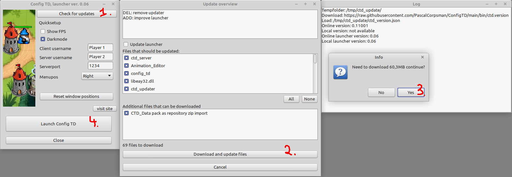

# Config Tower Defense (Config TD) Data Repository

This is the data repository for [Config TD](https://github.com/PascalCorpsman/ConfigTD).

This repository holds all additional data like maps, buildings, opponents, textures and what ever else someone can think of, that fills the game with life.

The idea behind is, to seperate code from user data, this way you can more easily contribute to the project.

## What needs to be done to play the game
1. Download the [ctd_launcher.exe](https://raw.githubusercontent.com/PascalCorpsman/ConfigTD/main/bin/ctd_launcher.exe) for windows users or the [ctd_launcher](https://raw.githubusercontent.com/PascalCorpsman/ConfigTD/main/bin/ctd_launcher) binary for linux 64 users.  
   - Linux users may need to make the binary executable (chmod +x)
   - [Optional] some Linux need to add the following packages:
       - SSL-Driver
         > sudo aptitude install libssl-dev
       - OpenGL driver
         > sudo apt-get install freeglut3-dev

2. Run the launcher 
   
   (1) press "Check for updates" 
   (2) press "Download and update files" 
   (3) confirm "Yes" to download and wait until the window closes 
   (4) press "Launch Config TD" and enjoy

3. Read the [manual](https://github.com/PascalCorpsman/ConfigTD/tree/main/documentation/Readme.md) as needed

## I want to contribute what is needed ?

The project always needs
- more units
- more buildings
- more maps
- more graphics
- more tutorials

### Rules to contribute:

- The Project language is english
- All content you contribute need to be free and compatible to the projects [license](license.md)

## External sources

This repository holds lots of images that are not only created by the owner, following is the list of external sources used to create some of the graphics:

Charactes:
* https://jetrotal.github.io/EasyChar/
* https://sanderfrenken.github.io/Universal-LPC-Spritesheet-Character-Generator/
  
Maps:
* https://openai.com/dall-e-3
* https://dicegrimorium.com/free-rpg-map-library/

Towers:
* https://opengameart.org/content/stone-tower-defense-game-art
* https://opengameart.org/content/old-pixelart-scraps
