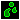

# Naming conventions for Config TD Data repository

The content of this repository splits more or less into 2 kinds of files
- graphics (*.bmp, *.png, *.jpg, *.ani)
- configurations (*.geb, *.hero, *.opp, *.map)

All file names (except *.map files) are build from "shortcut" patterns, as following there is a list of the already existing shortcuts and their description.

| Shortcut | Description |
| --- | --- |
| u | units (can be used for opponents / heros)
| b | buildings
| w | weapons
| pi | package identifier (see package identifier list)
| dc | damage class (see table damage per package identifier)
| level | number that can stand for a level 
| name | a arbiture name of a "thing"
| num | number that can stand for a arbiture number
| ext | file extension (.opp, .geb, .hero, .map, .bmp, .png, .jpg, .ani)

### List of already existing package identifiers
| \<pi> |  Description |
| --- | --- |
| C | colored graphic pack
| CC | reserved, do not use this identifier
| Co | comic graphic pack
| P | classic pixelart graphic pack

### List of damage classes per package identifier

| \<pi> | Damage class 1 | Damage class 2 | Damage class 3 | Damage class 4 |
| --- | --- | --- | --- | --- |
| C | Y(ellow)  | G(reen) | R(ed)  | B(lue) 
| Co | Y(ellow)  | G(reen) | R(ed)  | B(lue) 
| P | S(titch)  | P(oisen) | M(agic) | A(ir) 

If a building does not make a damage on any damageclasses \<dc> could be "empty". 
If a building / hero does a damage on multiple damageclasses \<dc> can be concatenated or only the "first" can be used.

### Concrete naming conventions

The following naming conventions shall be used when creating filenames:
- Do not use "space" in filenames / folders instead use the underline char "_"

The syntax of the patterns is as following:

\<shurtcut> = shortcut as in the lists above 
\[ \] = optional shortcut

|  Usecase | Pattern| example |  Description |
| --- | --- | --- | --- |
| Graphic | \<u>\<pi>\_\<name>\_\<level>\[_\<num>]\<ext> | uC_B_1.ani | opponent / hero graphic for colored package named "B" suggested for level 1
| Graphic | \<b>\<pi>\_\<name>\_\<level>\[_\<num>]\<ext> | bP_10_1.ani | building graphic for classic pixelart package named "10" suggested for stage 1 
| Graphic | \<w>\<pi>\_\<name>\[_\<num>]\<ext> | wC_star.ani | weapon graphic for colored package named "star"
| Graphic | \<name>\<ext> | castle.jpg | arbiture texture named "castle" (e.g. for background image creation)
| Opponent name | \<pi>\_\<dc>\_\<name>\[_\<num>] | C_B_Blue | Colored graphic set, damage class "B", name "Blue"
| Building name | \<pi>\_\<dc>\_\<name>\[_\<num>] | C_G_Canon | Colored graphic set, damage class "G", name "Canon"
| Hero name | \<pi>\_\<name>\[_\<num>] | Co_Knight | Comic graphic set, name "Knight"
| Map name | \<name>[_\<num>] | Castle | Map "Castle"
