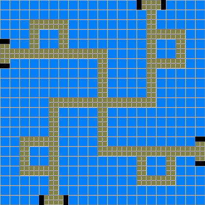
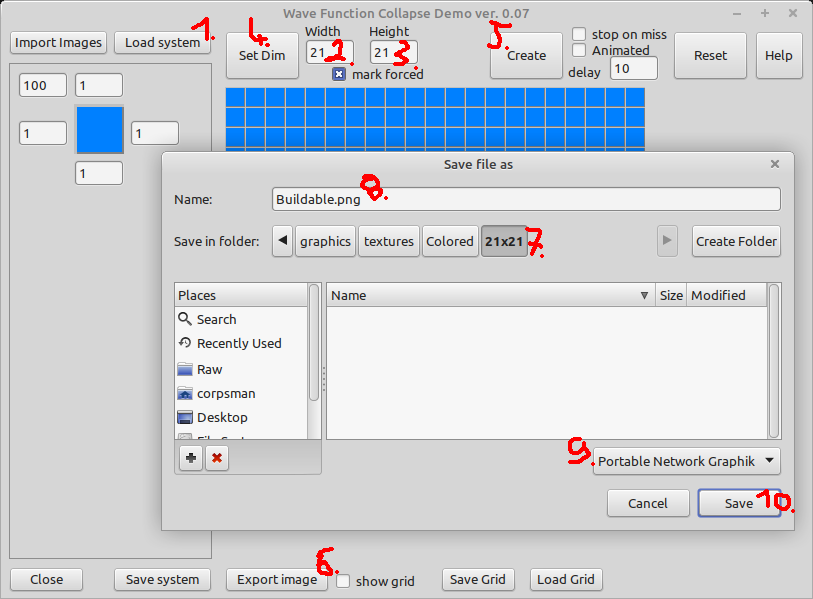
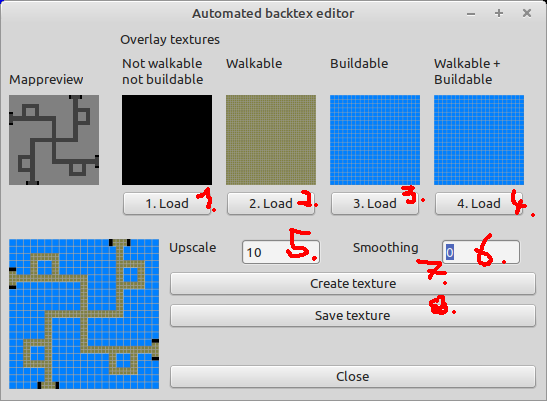

# Colored background texture guide

This guide explains how to create the nice looking Colored background images from scratch. 

- Choose the dimension you want to create your map in, for this example we choose 21 tiles in width and 21 tiles in height.

- Open the wfc application from the [Raw](../MiniTD/Raw) folder (its source code can be found [here](https://github.com/PascalCorpsman/mini_projects/tree/main/miniprojects/Wave_function_collapse/Tile_model))

  1. Load the "Buildable.sys" file
  2. Set Width -> 21
  3. Set Height -> 21
  4. Click "Set Dim" button
  5. Click "Create" (as often as you want)
  6. Click "Export image"
  7. Choose the precreated subfolder, named after your choosen dimensions here (21x21)
  8. Name the file "Buildable.png"
  9. Choose output format "Portable Network Graphik" (this saves disc space)
  10. Click "Save"

Repeat this step for Nothing.sys and Walkable.sys (doubling the width and height)

Follow then the [Mapguide](https://github.com/PascalCorpsman/ConfigTD/blob/main/documentation/mapguide.md) step 4 to create the walkable, buildable and "None" areas (do not use the feature walkable and buildable). When creating the map background texture step 6 use the following settings:

  1. Load the "None" image
  2. Load the "Walkable" image
  3. Load the "Buildable" image
  4. Load any graphik you want, it will be ignored anyway
  5. To get best results use "Upscale" with 10
  6. and set "Smoothing" to 0
  7. Click "Create texture"
  8. Click "Save texture"
  9. Choose a name
  10. And set the file format to "PNG" (JPEG Images will decrease image quality here due to the agressive compression)
  11. "Save"

When done you can import the backtexture like shown in [Mapguide](https://github.com/PascalCorpsman/ConfigTD/blob/main/documentation/mapguide.md) in step 7.