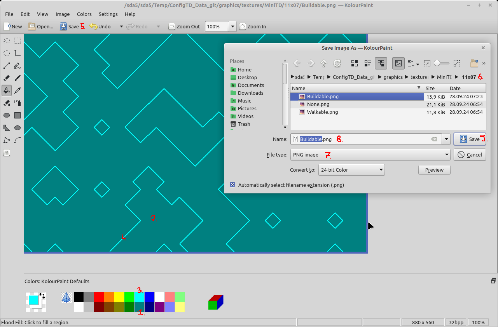

# MiniTD background texture guide

This guide explains how to create the nice looking MiniTD background images from scratch. This is only needed if you want to create a new MiniTD map with a size not listed in this folder.

- Choose the dimension you want to create your map in, for this example we choose 11 tiles in width and 7 tiles ind height.

- Open the wfc application from the [Raw](Raw) folder (its source code can be found [here](https://github.com/PascalCorpsman/mini_projects/tree/main/miniprojects/Wave_function_collapse/Tile_model))

  1. Load the "None.sys" file
  2. Set Width -> 11
  3. Set Height -> 7
  4. Click "Set Dim" button
  5. Click "Create" (as often as you want)
  6. Click "Export image"
  7. Choose the precreated subfolder, named after your choosen dimensions here (11x07)
  8. Name the file "None.png"
  9. Choose output format "Portable Network Graphik" (this saves disc space)
  10. Click "Save"

- Next we create the walkable texture by more or less doing the same as when creating the "None.png" 

  1. Load the "Walkable.sys" file
  2. Click "Create" (as often as you want)
  3. Click "Export image"
  4. Name the file "Walkable.png"
  5. Choose the precreated subfolder, named after your choosen dimensions here (11x07)
  6. Click "Save"
   

- The buildable texture will be created out of the walkable texture by manually editing the colors. In this example i choose KolourPaint (Windows Paint will also do the trick). To get started open the "walkable.png" with the image editor of choise.

  1. Select the main back color (Red=0, Green=128, Blue=128)
  2. Floodfill all background areas with the selected color
  3. Select the "line" color (Red=0, Green=255, Blue=255)
  4. Floodfill all lines with the selected color
  5. Click "Save" button
  6. Select the 11x07 folder
  7. Choose "PNG image"
  8. Name the file "Buildable.png"
  9. Click "Save"

Thats it, you have created a new texture set for MiniTD background images. All left to do is creating your new map using the [Mapguide](https://github.com/PascalCorpsman/ConfigTD/blob/main/documentation/mapguide.md). 

To get the best results you should choose the map dimensions twice as big as the tile dimension. So when using the 11x07 Background images choose 22x14 as map dimension.

Follow then the [Mapguide](https://github.com/PascalCorpsman/ConfigTD/blob/main/documentation/mapguide.md) step 4 to create the walkable, buildable and "None" areas (do not use the feature walkable and buildable). When creating the map background texture step 6 use the following settings:

  1. \- 4. Load the textures you created above, the "Walkable+Buildable" texture can be ignored.
  5. To get best results use "Upscale" with 40
  6. and set "Smoothing" to 0
  7. Click "Create texture"
  8. Click "Save texture"
  9. Choose a name
  10. And set the file format to "PNG" (JPEG Images will decrease image quality here due to the agressive compression)
  11. "Save" 

When done you can import the backtexture like shown in [Mapguide](https://github.com/PascalCorpsman/ConfigTD/blob/main/documentation/mapguide.md) in step 7.